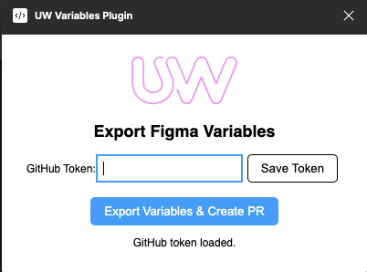

# Figma Variables Plugin

## How to use

1. Install the plugin
2. Open the plugin
3. Enter your GitHub token
4. Click on "Export Variables & Create PR" button
5. Wait for the plugin to finish
6. Done! 🎉